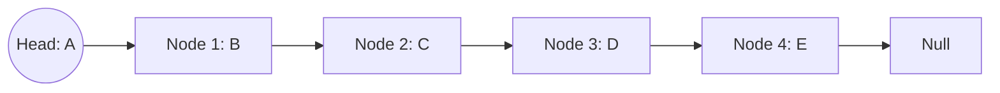
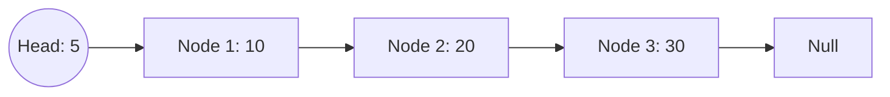
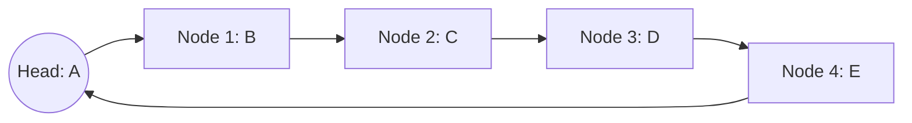

# Linked List in Data Structures

A **Linked List** is a linear data structure where elements are not stored in contiguous memory locations. Instead, each element, or node, contains a reference (or link) to the next node in the sequence. This structure allows for efficient insertions and deletions, as we don't need to shift elements as in arrays.

## Structure of a Node

```c
struct Node {
  int data;
  struct Node *next;
};
```

### Diagram of a Simple Linked List


## Characteristics of a Linked List:
- **Dynamic Size**: Can grow or shrink at runtime.
- **Efficient Insertions/Deletions**: Particularly at the beginning and middle.
- **Non-contiguous Memory**: Elements are scattered across the memory.

## Types of Linked Lists:
1. **Singly Linked List**: Each node contains a single link to the next node.
2. **Doubly Linked List**: Each node contains links to both the next and previous nodes.
3. **Circular Linked List**: The last node points back to the first node, making a circular chain.

---

# Types of Linked Lists

Linked Lists come in various forms depending on the structure and how nodes are connected to each other. The primary types are:

1. **Singly Linked List**
2. **Doubly Linked List**
3. **Circular Linked List**

---

## 1. Singly Linked List

A **Singly Linked List** is the most basic type of linked list. In this list, each node points to the next node, and the last node points to `null` (or `nullptr`), marking the end of the list.

### Structure of Singly Linked List:
- Each node contains two fields:
  - **Data**: Stores the value or information.
  - **Next**: Points to the next node in the list.

### Diagram:


---

## 2. Doubly Linked List

A **Doubly Linked List** allows traversal in both forward and backward directions. Each node contains links to both its previous and next nodes.

### Diagram:


---

## 3. Circular Linked List

In a **Circular Linked List**, the last node points back to the first node, forming a circular chain. This can be implemented as either singly or doubly linked.

### Diagram:


---

## Insertion in a Linked List

### Steps for Insertion:
1. **Create a New Node**:
   - Allocate memory for the new node.
   - Assign the data to the new node.
2. **Identify the Location**:
   - Decide whether to insert at the beginning, end, or a specific position.
3. **Adjust Pointers**:
   - For insertion at the beginning:
     - Set the new node's `next` to point to the current head.
     - Update the head to the new node.
   - For insertion at the end:
     - Traverse to the last node.
     - Set the last node's `next` to the new node.
     - Set the new node's `next` to `NULL`.
   - For insertion at a specific position:
     - Traverse to the node just before the desired position.
     - Set the new node's `next` to point to the next node.
     - Update the previous node's `next` to the new node.

### Pseudo Code:
```c
struct Node* newNode = (struct Node*)malloc(sizeof(struct Node));
newNode->data = value;
if (position == 0) {
    newNode->next = head;
    head = newNode;
} else {
    struct Node* temp = head;
    for (int i = 0; i < position - 1; i++) {
        temp = temp->next;
    }
    newNode->next = temp->next;
    temp->next = newNode;
}
```

---

## Deletion in a Linked List

### Steps for Deletion:
1. **Identify the Node to Delete**:
   - Decide whether to delete from the beginning, end, or a specific position.
2. **Adjust Pointers**:
   - For deletion at the beginning:
     - Set the head to the next node.
     - Free the old head node.
   - For deletion at the end:
     - Traverse to the second-last node.
     - Set its `next` to `NULL`.
     - Free the last node.
   - For deletion at a specific position:
     - Traverse to the node just before the one to be deleted.
     - Update its `next` pointer to skip the node to be deleted.
     - Free the deleted node.

### Pseudo Code:
```c
if (position == 0) {
    struct Node* temp = head;
    head = head->next;
    free(temp);
} else {
    struct Node* temp = head;
    for (int i = 0; i < position - 1; i++) {
        temp = temp->next;
    }
    struct Node* toDelete = temp->next;
    temp->next = toDelete->next;
    free(toDelete);
}
```
