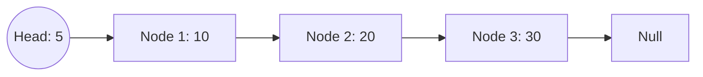
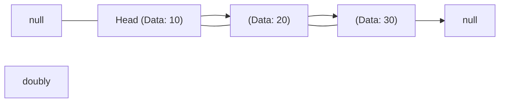

# Linked List in Data Structures

A **Linked List** is a linear data structure where elements are not stored in contiguous memory locations. Instead, each element, or node, contains a reference (or link) to the next node in the sequence. This structure allows for efficient insertions and deletions, as we don't need to shift elements as in arrays.

## Structure of a Node

```c
struct Node {
  int data;
  struct Node * next;
};
```
### Diagram of a simple linked list
```mermaid
classDiagram
HEAD --|> NODE_1
NODE_2 <|-- NODE_1
NODE_2 --|> NODE_3
NODE_4 <|-- NODE_3
HEAD: Data - A
HEAD: Ptr NODE_1 )
NODE_1: Data - B
NODE_1: Ptr NODE_2 )
NODE_2: Data - C
NODE_2: Ptr NODE_3 )
NODE_3: Data - D
NODE_3: Ptr NODE_4 )
NODE_4: Data - E
NODE_4: Ptr  NULL )
```
## Characteristics of a Linked List:
- **Dynamic Size**: Can grow or shrink at runtime.
- **Efficient Insertions/Deletions**: Particularly at the beginning and middle.
- **Non-contiguous Memory**: Elements are scattered across the memory.

## Types of Linked Lists:
1. **Singly Linked List**: Each node contains a single link to the next node.
2. **Doubly Linked List**: Each node contains links to both the next and previous nodes.
3. **Circular Linked List**: The last node points back to the first node, making a circular chain.

---

# Types of Linked Lists

Linked Lists come in various forms depending on the structure and how nodes are connected to each other. The primary types are:

1. **Singly Linked List**
2. **Doubly Linked List**
3. **Circular Linked List**

---

## 1. Singly Linked List

A **Singly Linked List** is the most basic type of linked list. In this list, each node points to the next node, and the last node points to `null` (or `nullptr`), marking the end of the list.

### Structure of Singly Linked List:
- Each node contains two fields:
  - **Data**: Stores the value or information.
  - **Next**: Points to the next node in the list.

### Diagram:



```mermaid
graph LR
  Node1["Head (Data: 10)"] --> Node2["(Data: 20)"]
  Node2 --> Node3["(Data: 30)"]
  Node3 --> Null["null"]
  idk figure out  later
  
```


```mermaid
flowchart LR
    NULL[Null] <-- HEAD[Head: A] --> NODE1[Node 1: B]
    NODE1 <-- HEAD
    NODE1 --> NODE2[Node 2: C]
    NODE2 <-- NODE1
    NODE2 --> NODE3[Node 3: D]
    NODE3 <-- NODE2
    NODE3 --> NODE4[Node 4: E]
    NODE4 <-- NODE3
    NODE4 --> NULL[Null]
    doubly
    ```


```mermaid
flowchart LR
    HEAD((Head: A)) --> NODE1[Node 1: B]
    NODE1 --> NODE2[Node 2: C]
    NODE2 --> NODE3[Node 3: D]
    NODE3 --> NODE4[Node 4: E]
    NODE4 --> HEAD
circularLL

```
