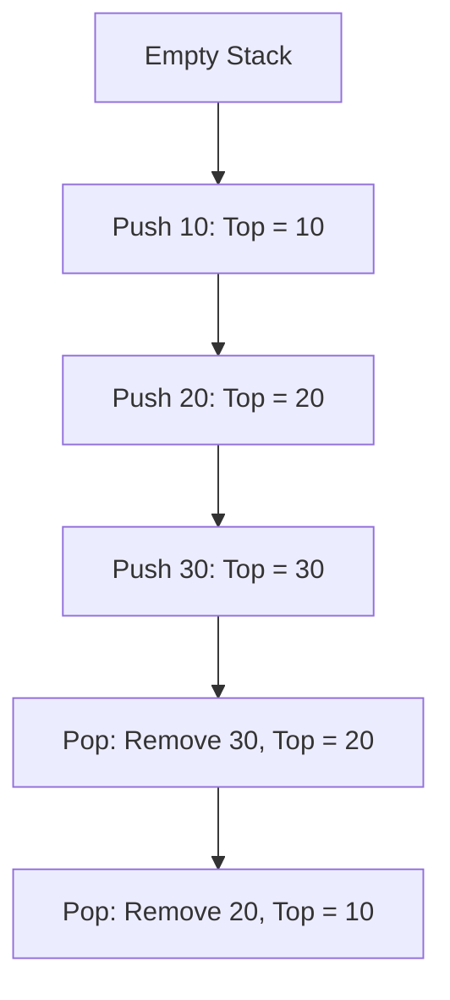
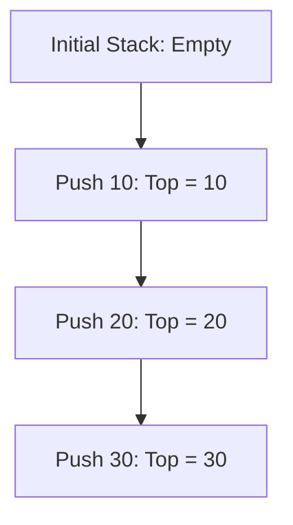
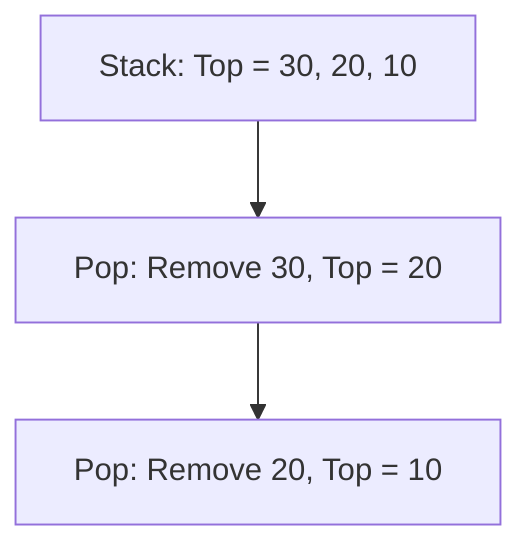
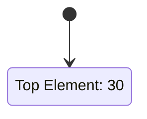
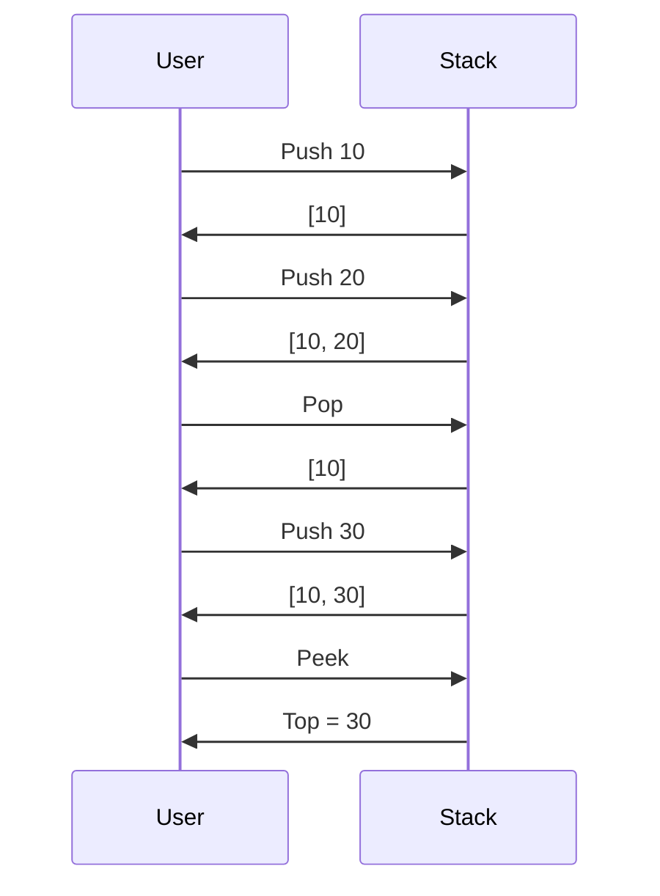

# STACK NOTES

## Definition
A **Stack** is a linear data structure that follows the **LIFO (Last In, First Out)** principle. This means that the last element added to the stack is the first one to be removed. It is analogous to a stack of plates where you can only add or remove the topmost plate.

**Diagram:**


---

## Features
1. **LIFO Order:** Last in, first out.
2. **Dynamic Size:** The size of the stack can grow or shrink as elements are pushed or popped.
3. **Restricted Access:** Only the top element can be accessed, pushed, or popped.
4. **Efficient Operations:** Push and pop operations take constant time, i.e., O(1).

---

## Difference with Other Linear Data Types

| Feature                 | Stack                     | Array                     | Linked List            |
|-------------------------|---------------------------|---------------------------|------------------------|
| **Access Type**         | LIFO                     | Random Access             | Sequential             |
| **Insertion/Deletion**  | Restricted to one end    | Anywhere                  | Anywhere               |
| **Memory**              | Fixed/Dynamic allocation | Contiguous allocation     | Dynamic allocation     |
| **Efficiency**          | Push/Pop: O(1)           | Insert/Delete: O(n)       | Insert/Delete: O(1)    |
| **Flexibility**         | Limited flexibility      | Static or flexible        | Highly flexible        |

---

## Operations on Stack

### 1. Push
**Description:** Add an element to the top of the stack.

**Steps:**
1. Check if the stack is full (for fixed-size stacks).
2. If not, increment the top pointer.
3. Insert the element at the top position.

**Diagram:**


**Pseudo Code:**
```pseudo
function PUSH(stack, element):
    if TOP == MAX_SIZE - 1:
        print("Stack Overflow")
        return
    TOP = TOP + 1
    stack[TOP] = element
```

---

### 2. Pop
**Description:** Remove the top element from the stack.

**Steps:**
1. Check if the stack is empty.
2. If not, retrieve the top element.
3. Decrement the top pointer.

**Diagram:**


**Pseudo Code:**
```pseudo
function POP(stack):
    if TOP == -1:
        print("Stack Underflow")
        return NULL
    element = stack[TOP]
    TOP = TOP - 1
    return element
```

---

### 3. Peek (or Top)
**Description:** Retrieve the top element without removing it.

**Steps:**
1. Check if the stack is empty.
2. If not, return the top element.

**Diagram:**


**Pseudo Code:**
```pseudo
function PEEK(stack):
    if TOP == -1:
        print("Stack is Empty")
        return NULL
    return stack[TOP]
```

---

### 4. isEmpty
**Description:** Check if the stack is empty.

**Steps:**
1. Check if the top pointer is -1.

**Pseudo Code:**
```pseudo
function isEmpty(stack):
    return TOP == -1
```

---

### 5. isFull
**Description:** Check if the stack is full (for fixed-size stacks).

**Steps:**
1. Check if the top pointer equals the maximum size - 1.

**Pseudo Code:**
```pseudo
function isFull(stack):
    return TOP == MAX_SIZE - 1
```

---

## Additional Notes
- **Applications of Stack:**
  1. Function Call Management (Call Stack)
  2. Expression Evaluation (Postfix and Prefix)
  3. Undo/Redo functionality in applications
  4. Backtracking (e.g., maze solving, navigating browser history)
  5. Parsing expressions in compilers

- **Implementations:**
  - **Array-Based Stack:** Uses a fixed or dynamic array.
  - **Linked List Stack:** Uses a linked list for dynamic memory allocation.

- **Complexity Analysis:**
  | Operation  | Time Complexity |
  |------------|-----------------|
  | Push       | O(1)            |
  | Pop        | O(1)            |
  | Peek       | O(1)            |
  | isEmpty    | O(1)            |
  | isFull     | O(1)            |

---

## Example
### Pushing and Popping from a Stack
**Input:**
Push(10), Push(20), Pop(), Push(30), Peek()

**Output:**
Stack after operations: [10, 30]

**Explanation:**
1. Push 10 -> Stack: [10]
2. Push 20 -> Stack: [10, 20]
3. Pop -> Stack: [10]
4. Push 30 -> Stack: [10, 30]
5. Peek -> Top element: 30

**Diagram:**

